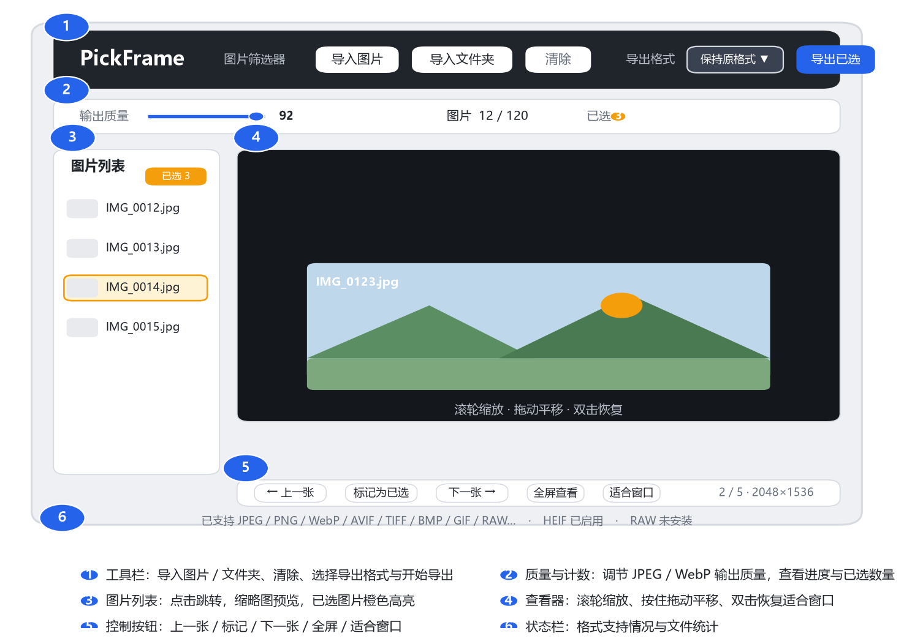
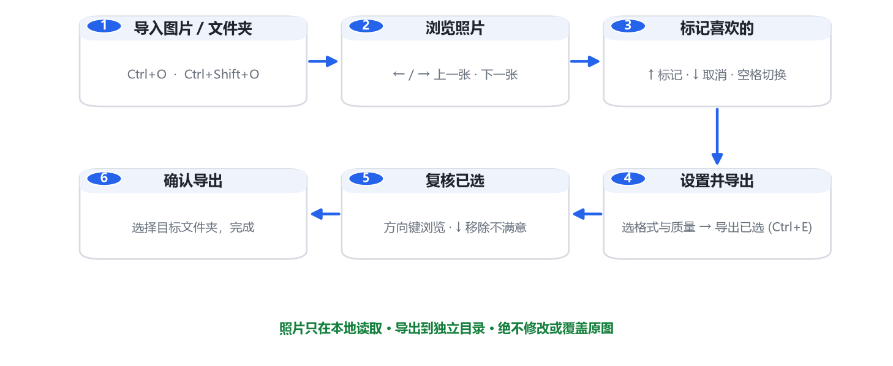

# PickFrame 图片筛选器 / Photo Filter

> **中文** · [**English**](#english-overview)

一个**本地运行**的 Windows 图片筛选工具：导入成百上千张照片，用键盘快速浏览、标记喜欢的，最后按格式与质量一键导出。图片只在电脑本地读取和导出，**不会上传**。

A **local-only** Windows photo filtering tool. Import hundreds or thousands of photos, browse and mark your favorites quickly with the keyboard, then export them in the format and quality you choose — all in one click. Images are read and exported only on your computer; **nothing is uploaded**.

> 适合整理相机/手机导出的海量照片、从旅行/活动中挑出满意的成片、清理相册。
> Perfect for sorting huge camera/phone photo dumps, picking your best shots from a trip or event, and cleaning up your photo library.

---

## English Overview

**PickFrame** is a keyboard-first image browser & filter written in Python + Tkinter.

- **Keyboard speed** — `←`/`→` to browse, `↑`/`↓`/`Space` to mark — no mouse needed.
- **Full-screen & zoom** — scroll to zoom, drag to pan, double-click to fit, `F11` full-screen.
- **Batch workflow** — recursive folder import, thumbnail list with orange highlight for selected shots.
- **Flexible export** — keep original format, or convert to JPEG / PNG / WebP / TIFF / BMP with adjustable quality.
- **Review before export** — preview your picks, press `↓` to drop any you change your mind about.
- **Broad format support** — everything Pillow can decode, plus optional HEIC/HEIF and camera RAW (DNG, CR2/CR3, NEF, ARW, RAF, RW2, …).
- **100% safe** — source photos are never moved, overwritten, or modified; exports go to a separate folder.

---

## ✨ 功能特性 Features

- **快如键盘**：`←`/`→` 翻页，`↑`/`↓`/`空格` 标记，全程无需鼠标
- **大图体验**：鼠标滚轮缩放、按住拖动平移、双击恢复、`F11` 全屏
- **批量管理**：递归导入文件夹，左侧缩略图列表，已选图片橙色高亮
- **灵活导出**：支持保持原格式 / JPEG / PNG / WebP / TIFF / BMP，可调输出质量
- **导出前复核**：先预览已选图片，`↓` 一键移除不满意的再确认
- **格式广泛**：Pillow 全系格式，可选扩展 HEIC/HEIF 与相机 RAW（DNG、CR2/CR3、NEF 等）
- **绝对安全**：只读取原图，导出到独立目录，绝不移动、覆盖或修改原图

- **Keyboard-fast**: `←`/`→` to browse, `↑`/`↓`/`Space` to mark — mouse-free workflow
- **Large-image experience**: scroll to zoom, drag to pan, double-click to reset, `F11` full-screen
- **Batch management**: recursive folder import, thumbnail sidebar, selected shots highlighted in orange
- **Flexible export**: keep original format or convert to JPEG / PNG / WebP / TIFF / BMP with quality control
- **Review before export**: preview your picks and remove any with a single `↓`
- **Broad format support**: the full Pillow family, plus optional HEIC/HEIF and camera RAW (DNG, CR2/CR3, NEF, …)
- **Absolutely safe**: source images are only read; exports go to a separate folder — never moved, overwritten, or modified

---

## 🖥️ 界面总览 UI Overview


*PickFrame UI overview*

| 区域 Area | 说明 Description |
|------|------|
| ① 工具栏 Toolbar | 导入图片 / 导入文件夹、清除列表、选择导出格式、开始导出 — Import files / folder, clear, choose export format, start export |
| ② 质量与计数 Quality & counter | 调节 JPEG / WebP 输出质量，查看浏览进度与已选数量 — JPEG/WebP quality, progress and selection counter |
| ③ 图片列表 Image list | 所有已导入图片，点击跳转，缩略图预览，已选橙色高亮 — All imported images, click to jump, thumbnails, selected highlighted |
| ④ 查看器 Viewer | 大图浏览区，滚轮缩放、拖动平移、双击恢复 — Large preview, scroll zoom, drag pan, double-click to fit |
| ⑤ 控制按钮 Controls | 上一张 / 标记为已选 / 下一张 / 全屏查看 / 适合窗口 — Prev / Mark / Next / Full-screen / Fit |
| ⑥ 状态栏 Status bar | 当前启用的格式支持与统计信息 — Enabled format support and statistics |

---

## 🚀 安装与启动 Installation & Launch

### 环境要求 Requirements

- Windows 10 / 11
- Python 3.10+（[python.org](https://www.python.org/downloads/) 安装时勾选 *Add Python to PATH*）
- Python 3.10+ ([download](https://www.python.org/downloads/), tick *Add Python to PATH* during install)

### 方法一：一键脚本（推荐）Method 1: One-click scripts (recommended)

双击依次运行 / Double-click and run in order:

1. `install_dependencies.bat` — 安装基础依赖（Pillow）/ install base dependencies (Pillow)
2. `start.bat` — 启动程序 / launch the app

> 提示：如需 HEIC/HEIF 与相机 RAW 支持，再双击一次 `install_optional_formats.bat`。
> Tip: for HEIC/HEIF and camera RAW support, also run `install_optional_formats.bat`.

### 方法二：命令行 Method 2: Command line

```bat
cd /d F:\photos_split
py -3 -m pip install -r requirements.txt
py -3 photo_selector.py
```

### 可选格式安装 Optional formats

```bat
install_optional_formats.bat
```

安装 `pillow-heif`（HEIC/HEIF/AVIF）与 `rawpy`（相机 RAW）。
Installs `pillow-heif` (HEIC/HEIF/AVIF) and `rawpy` (camera RAW).

---

## 📖 使用说明 Usage Guide


*PickFrame workflow*

### 1. 导入图片 Import images

- 点击工具栏「**导入图片**」选择多个文件，或按 `Ctrl+O` — Click **Import Files** in the toolbar, or press `Ctrl+O`
- 点击「**导入文件夹**」递归导入文件夹及子文件夹内全部图片，或按 `Ctrl+Shift+O` — Click **Import Folder** to import recursively, or press `Ctrl+Shift+O`

### 2. 浏览照片 Browse photos

- 按 `←` / `→`（或底部按钮）翻页浏览 — Press `←`/`→` (or the bottom buttons) to navigate
- 在图片上**滚动鼠标滚轮**缩放，**按住左键拖动**平移，**双击**恢复适合窗口 — **Scroll** to zoom, **drag** to pan, **double-click** to fit
- `F11` 进入全屏，全屏下所有筛选操作不变，`Esc` 或 `F11` 退出 — `F11` for full-screen; all filtering works the same there; `Esc` or `F11` to exit

### 3. 标记喜欢的 Mark favorites

- `↑` 标记当前图片为已选，`↓` 取消标记，`空格` 切换标记状态 — `↑` mark selected, `↓` unmark, `Space` toggle
- 底部「标记为已选」按钮可点击标记 — Or use the **Mark as Selected** button below the viewer
- 已选图片在左侧列表中以橙色高亮显示，数量实时更新 — Selected images are highlighted orange in the sidebar, counter updates live

### 4. 设置格式与质量并导出 Set format & quality, then export

- 工具栏选择**导出格式**（保持原格式 / JPEG / PNG / WebP / TIFF / BMP）— Choose the **export format** in the toolbar
- 「输出质量」滑条调节 JPEG / WebP 压缩质量（1–100，默认 92）— Adjust JPEG/WebP **quality** with the slider (1–100, default 92)
- 点击「**导出已选**」或按 `Ctrl+E` 进入复核 — Click **Export Selected** or press `Ctrl+E` to review

### 5. 复核已选 Review your picks

- 在复核界面用方向键逐张检查已选图片 — In review mode, browse picks with the arrow keys
- `↓` 移除不满意的图片，确认无误后点击「**确认导出**」— Press `↓` to remove any; when satisfied, click **Confirm Export**

### 6. 选择目标文件夹 Choose the destination

- 选择导出目录完成导出 — Pick an output folder to finish
- 导出目录**不能**与任一原图所在目录相同，程序只会复制或转换到单独目录 — The destination **cannot** equal any source folder; the app only copies/converts into a separate directory

---

## ⌨️ 快捷键一览 Keyboard Shortcuts

| 快捷键 Key | 功能 Function |
|--------|------|
| `←` / `→` | 上一张 / 下一张 Previous / Next |
| `↑` | 标记当前图片为已选 Mark current as selected |
| `↓` | 取消标记（复核界面中为移除该图片） Unmark (in review: remove this pick) |
| `空格` `Space` | 切换标记状态 Toggle selection |
| `Home` | 跳转到第一张 First image |
| `End` | 跳转到最后一张 Last image |
| `Esc` | 普通窗口：恢复适合窗口；全屏：退出全屏 Fit window / exit full-screen |
| `Ctrl+O` | 导入图片 Import files |
| `Ctrl+Shift+O` | 导入文件夹 Import folder |
| `Ctrl+E` | 导出已选（进入复核） Export selected (enter review) |
| `F11` | 切换全屏查看 Toggle full-screen |

---

## 🖼️ 支持的格式 Supported Formats

### 默认支持（Pillow 可解码）Built-in (Pillow-decodable)

JPEG/JFIF、PNG、WebP、AVIF、TIFF、BMP、GIF、ICO、PSD、PNM/PPM/PBM/PGM、PCX、QOI 等。动图导入后显示首帧。
JPEG/JFIF, PNG, WebP, AVIF, TIFF, BMP, GIF, ICO, PSD, PNM/PPM/PBM/PGM, PCX, QOI, and more. Animated images show their first frame.

### 可选扩展（需运行 `install_optional_formats.bat`）Optional (run `install_optional_formats.bat`)

- **HEIC / HEIF**（iPhone / 现代手机默认格式 — iPhone / modern phone default format）
- **相机 RAW Camera RAW**：DNG、CR2/CR3（佳能 Canon）、NEF（尼康 Nikon）、ARW（索尼 Sony）、RAF（富士 Fuji）、RW2（松下 Panasonic）等

### 导出格式 Export formats

| 格式 Format | 说明 Description |
|------|------|
| 保持原格式 Keep original | 复制原图，不转换 Copy as-is, no conversion |
| JPEG / PNG / WebP / TIFF / BMP | 转换导出，质量可调 Convert with adjustable quality |

> JPEG / BMP 不支持透明通道，透明区域会使用白色背景填充。
> JPEG / BMP do not support transparency; transparent areas are filled with white.

---

## 📤 导出说明 Export Notes

- **原图安全 Source safety**：程序只会复制或转换到单独目录，绝不会移动、覆盖或修改原图 — only copies/converts to a separate folder; never moves, overwrites, or modifies originals
- **防覆盖 No overwrite**：导出时不会覆盖已有文件；同名文件自动追加 `_2`、`_3` 等编号 — existing files are never overwritten; duplicates get `_2`, `_3`, … suffixes
- **目录限制 Destination rule**：导出目录不能与任一原图所在目录相同，防止误操作 — the destination cannot equal any source folder

---

## 📁 项目结构 Project Structure

```
photos_split/
├── photo_selector.py          # 主程序（Tkinter 界面 + 核心逻辑）Main app (Tkinter UI + logic)
├── test_photo_selector.py     # 单元测试（unittest）Unit tests (unittest)
├── requirements.txt           # 基础依赖（Pillow）Base dependencies
├── requirements-optional.txt  # 可选依赖（HEIC/RAW）Optional deps (HEIC/RAW)
├── install_dependencies.bat   # 一键安装基础依赖 Install base deps
├── install_optional_formats.bat # 一键安装可选格式支持 Install optional formats
├── start.bat                  # 一键启动 Launch
├── LICENSE                    # MIT 许可证 MIT license
├── ui_overview.png            # 界面示意图 UI overview diagram
└── workflow.png               # 操作流程图 Workflow diagram
```

---

## 🧪 测试 Testing

项目内置单元测试（`unittest`）Built-in unit tests (`unittest`):

```bat
py -3 -m unittest test_photo_selector
```

覆盖自然排序、递归发现图片、导出路径去重、原图安全校验等核心逻辑。
Covers natural sorting, recursive image discovery, export path dedup, and source-safety checks.

---

## 🔒 隐私声明 Privacy

程序**没有任何网络上传逻辑**。图片仅在本地读取与导出。唯一联网场景是执行依赖安装脚本时连接 Python 软件包源下载依赖。
The app has **no network upload logic**. Images are read and exported locally only. The only network access happens when dependency install scripts download packages from the Python package index.

---

## 🛠️ 技术栈 Tech Stack

- Python 3 + [Tkinter](https://docs.python.org/3/library/tkinter.html)（界面 UI）
- [Pillow](https://python-pillow.org/)（图片解码 / 转换 decode & convert）
- 可选 Optional：[pillow-heif](https://github.com/strukturag/libheif) / [rawpy](https://github.com/letmaik/rawpy)（HEIC / RAW）

---

## 📜 许可 License

本项目采用 [MIT 许可证](LICENSE)，版权归 © 2026 Sunye。
This project is licensed under the [MIT License](LICENSE). Copyright © 2026 Sunye.
